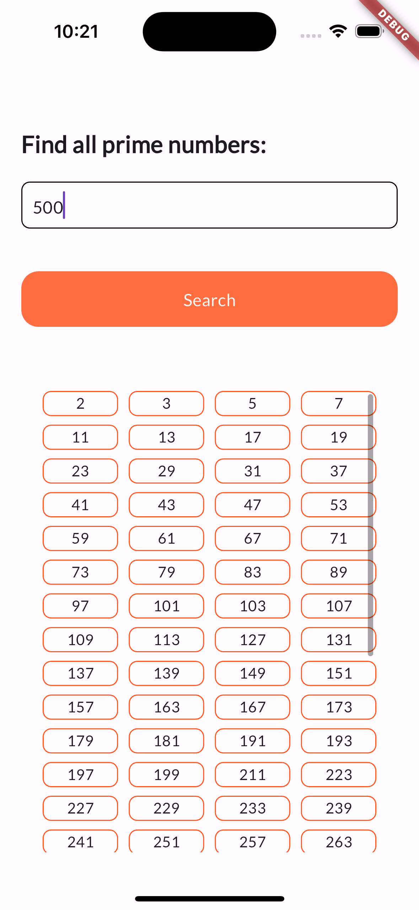

# Prime Number Finder (with Flutter Isolates)

This Flutter project efficiently finds prime numbers using **Flutter Isolates**, which enable concurrent computation without blocking the UI.

## 🚀 Features
- Finds all prime numbers up to a given maximum number.
- Uses **Flutter Isolates** for performance optimization.
- You can use either spawn or compute method.
- Provides a responsive UI while processing large numbers, i.e the main thread isn't blocked,hence the screen isn't frozen.

